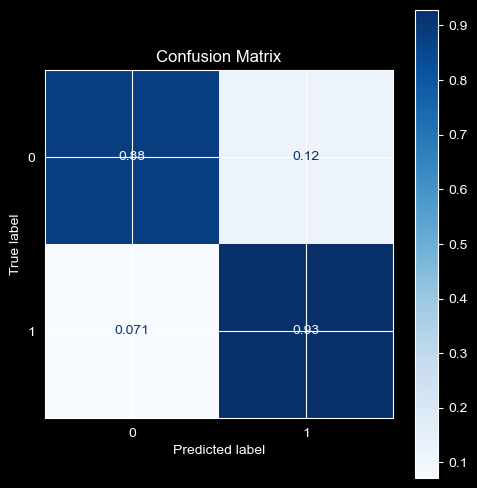
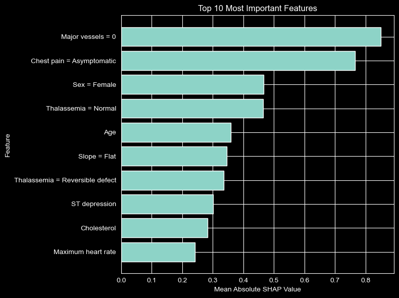
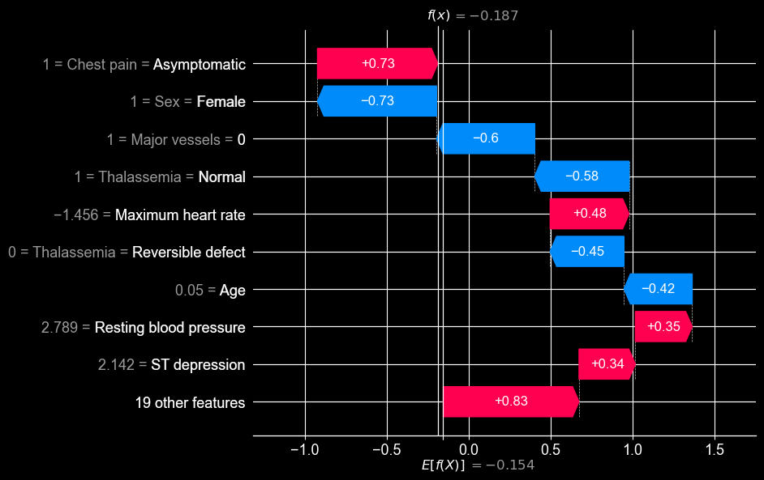
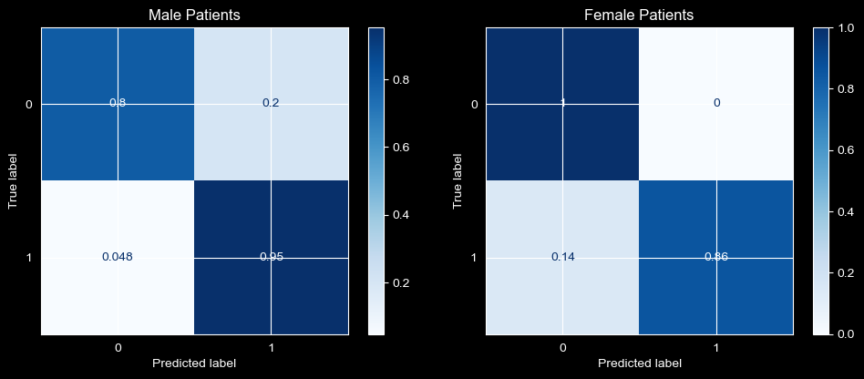

# Heart Disease Prediction with Explainable and Fair Machine Learning


This project explores the use of machine learning for cardiovascular risk prediction using clinical data, with a strong focus on explainability and fairness in clinical decision support systems. It uses for this purpose the Cleveland Heart Disease Dataset (DOI: https://doi.org/10.24432/C52P4X)
The objective is not only to build an accurate predictive model, but also to understand its decision-making process and evaluate its fairness across demographic groups.
Such approaches could support clinicians in identifying high-risk patients while ensuring transparency and equity in decision-making.

The project includes:

- End-to-end machine learning pipeline
- Model comparison and hyperparameter optimization
- SHAP-based explainability analysis
- Local explanation of individual predictions
- Fairness evaluation across male and female patients

---

## Key Results

Final model: **XGBoost**

| Metric | Value |
|---|---:|
| Accuracy | 90% |
| Recall | 93% |
| F1-score | 90% |
| ROC-AUC | 95.5% |

---

High recall (93%) ensures that most patients with heart disease are correctly identified, which is critical in a medical context.

## Dataset

The project uses the **Cleveland Heart Disease dataset** from the UCI Machine Learning Repository.

The dataset contains demographic, clinical, and diagnostic features such as:

- Age
- Sex
- Chest pain type
- Resting blood pressure
- Cholesterol
- Maximum heart rate
- Exercise-induced angina
- ST depression
- Thalassemia status
- Number of major vessels

The target variable indicates the presence or absence of heart disease.

---

## Methodology

The project follows a complete machine learning workflow:

1. Data exploration and preprocessing
2. Train-test split
3. Preprocessing pipeline with imputation, scaling, and one-hot encoding
4. Model comparison between Logistic Regression, Random Forest, and XGBoost
5. Hyperparameter optimization of XGBoost
6. Global and local explainability using SHAP
7. Fairness analysis by sex

---

## Model Comparison

| Model | Accuracy | Recall | F1-score | ROC-AUC |
|---|---:|---:|---:|---:|
| Logistic Regression | 0.89 | 0.93 | 0.88 | 0.97 |
| Random Forest | 0.85 | 0.81 | 0.85 | 0.94 |
| XGBoost | 0.90 | 0.96 | 0.90 | 0.95 |

XGBoost was selected because it achieved the best balance between recall and F1-score, which is particularly important in a healthcare context where false negatives may have serious consequences.

---

## Model Performance



---

## Global Explainability

SHAP was used to understand which features most strongly influenced the model's predictions.


The most influential features included:

- Number of major vessels
- Chest pain type
- Sex
- Thalassemia status
- Age
- ST depression
- Maximum heart rate

These features are clinically meaningful and consistent with known cardiovascular risk factors.

---

## Quantitative Feature Importance



The SHAP feature importance ranking confirmed that the model relied mainly on medically relevant indicators. The absence of major vessel obstruction and asymptomatic chest pain were the two most influential predictors.

---

## Local Explainability

To better understand individual predictions, SHAP waterfall plots were used to analyze specific patient cases.

The example below shows a false negative case, where the patient had heart disease but was incorrectly classified as healthy.



This case showed that although several symptoms increased the predicted risk, other factors such as absence of major vessel obstruction, normal thalassemia findings, and female sex reduced the predicted probability enough to produce an incorrect negative prediction.

---

## Fairness Analysis

Because sex was identified as an influential feature during SHAP analysis, the model's performance was evaluated separately for male and female patients.



The subgroup analysis showed strong performance for both groups. Female patients had slightly lower recall for the positive class, while male patients had more false positives. However, due to the small number of female positive cases, these differences should be interpreted with caution.

This highlights the importance of carefully evaluating model performance across demographic groups in healthcare applications.

---

## Limitations

Several limitations should be acknowledged:

- The dataset is relatively small.
- The fairness analysis is limited by subgroup sample sizes.
- The model was not externally validated on another dataset.
- SHAP explanations describe model behavior but do not prove causal relationships.
- The project should not be interpreted as a clinical diagnostic tool.

---

## Future Work

Possible extensions include:

- External validation on larger and more diverse datasets
- Probability calibration
- Advanced fairness metrics such as equal opportunity and equalized odds
- More detailed subgroup analysis
- Autoencoder-based anomaly detection for healthcare applications
- Comparison with additional explainable machine learning methods

---

## Technologies

- Python
- Pandas
- NumPy
- Scikit-learn
- XGBoost
- SHAP
- Matplotlib
- Seaborn
- Jupyter Notebook

---

## Repository Structure

```text
heart-disease-prediction-xai-fairness/
│
├── README.md
├── LICENSE
├── requirements.txt
│
├── notebook/
│   └── Heart_Disease_Prediction.ipynb
│
├── figures/
│   ├── confusion_matrix.png
│   ├── shap_summary.png
│   ├── shap_feature_importance.png
│   ├── false_negative_waterfall.png
│   └── fairness_analysis.png
│
└── models/
    └── heart_disease_xgb_model.pkl
```

---

## Contact

**Salaheddine Aït Radi**

Engineering student at Télécom SudParis  
Interested in machine learning, healthcare AI, explainability, and fairness.

LinkedIn: https://www.linkedin.com/in/salaheddine-a%C3%AFt-radi/  
